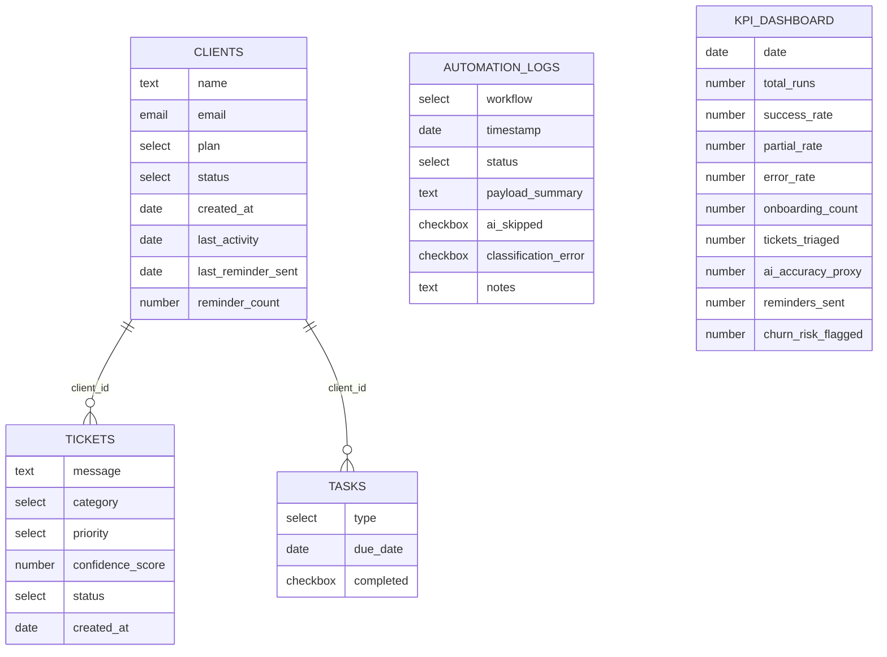

# Schema Airtable — PostSalesOpsLab

## Introduzione

`PostSalesOpsLab` è la base Airtable che funge da database operativo del progetto
**Post-Sales AI Ops Lab**. Tutti i workflow n8n leggono e scrivono su questa base
per gestire il ciclo di vita del cliente post-vendita: onboarding, ticket di
supporto, task interne, log delle automazioni e KPI aggregate.

La base è composta da **5 tabelle**:

| Tabella | Ruolo |
|---|---|
| `Clients` | Anagrafica clienti e stato del ciclo di vita (CRM minimale) |
| `Tickets` | Ticket di supporto classificati automaticamente |
| `Tasks` | Attività operative generate dai workflow (es. onboarding) |
| `Automation Logs` | Log di ogni esecuzione dei workflow, con esito |
| `KPI Dashboard` | Metriche aggregate calcolate dal Monitoring Board |

Le tabelle `Tickets` e `Tasks` sono collegate a `Clients` tramite il campo
`client_id` (Link to another record). `Automation Logs` e `KPI Dashboard` non
hanno link diretti: aggregano dati calcolati a partire dalle altre tabelle.

---

## Tabella: Clients

**Scopo:** anagrafica dei clienti e stato del ciclo di vita post-vendita
(onboarding, attività, retention, churn risk).

| Campo | Tipo Airtable | Valori ammessi | Note d'uso |
|---|---|---|---|
| `id` | Record ID (automatico) | — | ID generato da Airtable, formato `recXXXXXXXXXXXXXX` |
| `name` | Single line text | testo libero | Nome del cliente |
| `email` | Email | formato email valido | Chiave di matching per upsert (Workflow 01) |
| `plan` | Single select | `free`, `starter`, `pro` | Piano acquistato, usato per personalizzare email |
| `status` | Single select | `active`, `churned`, `churn_risk` | Aggiornato dal Workflow 03 |
| `created_at` | Date (Include time) | — | Data di creazione del cliente |
| `last_activity` | Date (Include time) | — | Usato dal Workflow 03 per individuare clienti inattivi (> 14 giorni) |
| `last_reminder_sent` | Date (Include time) | — | Aggiornato dal Workflow 03 ad ogni reminder inviato |
| `reminder_count` | Number | intero, default `0` | Incrementato ad ogni reminder; a 3 il cliente passa a `churn_risk` |

---

## Tabella: Tickets

**Scopo:** raccolta e classificazione automatica dei ticket di supporto.

| Campo | Tipo Airtable | Valori ammessi | Note d'uso |
|---|---|---|---|
| `id` | Record ID (automatico) | — | ID generato da Airtable |
| `client_id` | Link to another record → `Clients` | record di `Clients` | Recuperato dal Workflow 02 cercando il cliente per email |
| `message` | Long text | testo libero | Testo originale del ticket inviato dal cliente |
| `category` | Single select | `billing`, `bug`, `feature_request`, `how_to`, `other`, `unknown` | `unknown` è il valore di fallback se la classificazione LLM fallisce |
| `priority` | Single select | `low`, `medium`, `high`, `critical` | `critical` attiva l'alert Slack immediato |
| `confidence_score` | Number | float `0`–`1` | Confidence restituita dal modello LLM nella classificazione |
| `status` | Single select | `open`, `in_progress`, `closed` | Stato di gestione del ticket |
| `created_at` | Date (Include time) | — | Data/ora di creazione del ticket |

---

## Tabella: Tasks

**Scopo:** attività operative generate automaticamente dai workflow (es. follow-up
di onboarding, revisioni manuali).

| Campo | Tipo Airtable | Valori ammessi | Note d'uso |
|---|---|---|---|
| `id` | Record ID (automatico) | — | ID generato da Airtable |
| `client_id` | Link to another record → `Clients` | record di `Clients` | Cliente a cui è associata la task |
| `type` | Single select | `onboarding`, `follow_up`, `manual_review` | Tipo di attività |
| `due_date` | Date (Include time) | — | Scadenza task (per onboarding: +3 giorni dalla creazione) |
| `completed` | Checkbox | `true` / `false`, default `false` | Stato di completamento |

---

## Tabella: Automation Logs

**Scopo:** registro di ogni esecuzione dei workflow, con esito e dettagli per il
troubleshooting. È la fonte primaria per il Monitoring Board.

| Campo | Tipo Airtable | Valori ammessi | Note d'uso |
|---|---|---|---|
| `id` | Record ID (automatico) | — | ID generato da Airtable |
| `workflow` | Single select | `onboarding`, `triage`, `retention`, `monitoring` | Identifica quale workflow ha generato il log |
| `timestamp` | Date (Include time) | — | Data/ora dell'esecuzione |
| `status` | Single select | `success`, `partial`, `failed` | `partial` indica fallback AI attivato |
| `payload_summary` | Long text | testo libero | Sintesi dei dati elaborati nella run |
| `ai_skipped` | Checkbox | `true` / `false` | `true` se il fallback statico è stato usato al posto dell'AI |
| `classification_error` | Checkbox | `true` / `false` | `true` se la risposta LLM non era JSON valido (solo Workflow 02) |
| `notes` | Long text | testo libero | Note aggiuntive (es. "No clients to process") |

---

## Tabella: KPI Dashboard

**Scopo:** metriche aggregate calcolate ogni ora dal Monitoring Board (Workflow 05)
a partire da `Automation Logs`, `Clients` e `Tickets`.

| Campo | Tipo Airtable | Valori ammessi | Note d'uso |
|---|---|---|---|
| `date` | Date | — | Data di riferimento dell'aggregazione |
| `total_runs` | Number | intero | Numero totale di esecuzioni workflow (ultimi 7 giorni) |
| `success_rate` | Number | float, percentuale | % di run con `status: success` |
| `partial_rate` | Number | float, percentuale | % di run con `status: partial` |
| `error_rate` | Number | float, percentuale | % di run con `status: failed`; se > 20 scatta alert Slack |
| `onboarding_count` | Number | intero | Nuovi clienti onboardati negli ultimi 7 giorni |
| `tickets_triaged` | Number | intero | Ticket classificati automaticamente negli ultimi 7 giorni |
| `ai_accuracy_proxy` | Number | float | Media di `confidence_score` su `Tickets` |
| `reminders_sent` | Number | intero | Email di retention inviate (da `Automation Logs`) |
| `churn_risk_flagged` | Number | intero | Clienti con `status: churn_risk` |

---

## Diagramma delle relazioni

> `Automation Logs` e `KPI Dashboard` non hanno campi Link diretti verso le altre
> tabelle: i workflow leggono/scrivono questi dati tramite filtri (es. su
> `timestamp` o `created_at`), non tramite relazioni Airtable.

---

## Logica di accesso

| Workflow | Legge da | Scrive su |
|---|---|---|
| **01 — Onboarding** | `Clients` (match su `email` per upsert) | `Clients` (upsert), `Tasks` (create, `type: onboarding`), `Automation Logs` (create) |
| **02 — Ticket Triage** | `Clients` (ricerca `client_id` per `email`) | `Tickets` (create), `Automation Logs` (create) |
| **03 — Retention Reminder** | `Clients` (filtro `status: active` e `last_activity` > 14 giorni) | `Clients` (update `last_reminder_sent`, `reminder_count`, `status`), `Automation Logs` (create) |
| **04 — Voice Follow-Up (stub)** | — | — (workflow `Inactive`, nessuna interazione con Airtable) |
| **05 — Monitoring Board** | `Automation Logs` (ultimi 7 giorni), `Clients` (`created_at`, `status`), `Tickets` (`created_at`, `confidence_score`) | `KPI Dashboard` (create/update) |

---

## Record di test

Dati di esempio da inserire manualmente in Airtable per testare i workflow end-to-end.

**Clients**

| name | email | plan | status | created_at | last_activity | last_reminder_sent | reminder_count |
|---|---|---|---|---|---|---|---|
| Mario Rossi | mario.rossi@test.com | pro | active | 2026-05-01 09:00 | 2026-05-26 10:00 | 2026-06-05 09:00 | 1 |

> `last_activity` impostato a ~20 giorni fa e `last_reminder_sent` a ~10 giorni fa
> per rientrare nelle condizioni del Workflow 03 (vedi
> `playbook_troubleshooting.md`, sezione "Reset ambiente di test").

**Tickets**

| client_id | message | category | priority | confidence_score | status | created_at |
|---|---|---|---|---|---|---|
| → Mario Rossi | "Non riesco ad accedere al mio account, mi dice password errata ma sono sicuro sia corretta." | bug | medium | 0.78 | open | 2026-06-15 10:30 |

**Tasks**

| client_id | type | due_date | completed |
|---|---|---|---|
| → Mario Rossi | onboarding | 2026-05-04 09:00 | true |

**Automation Logs**

| workflow | timestamp | status | payload_summary | ai_skipped | classification_error | notes |
|---|---|---|---|---|---|---|
| onboarding | 2026-05-01 09:05 | success | Cliente Mario Rossi onboardato, piano pro | false | false | |

**KPI Dashboard**

| date | total_runs | success_rate | partial_rate | error_rate | onboarding_count | tickets_triaged | ai_accuracy_proxy | reminders_sent | churn_risk_flagged |
|---|---|---|---|---|---|---|---|---|---|
| 2026-06-15 | 12 | 83.3 | 8.3 | 8.3 | 1 | 1 | 0.78 | 0 | 0 |
