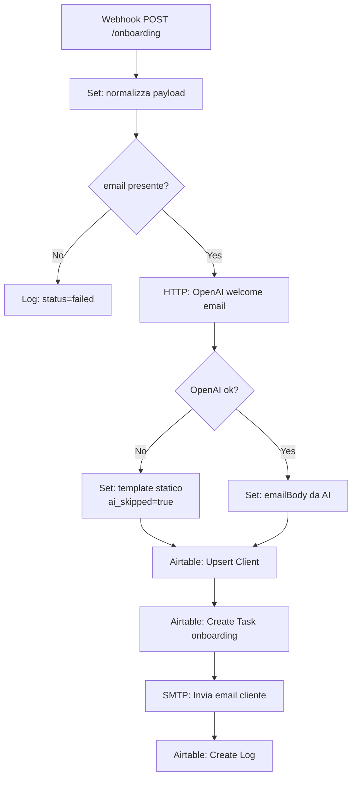

# Post-Sales AI Ops Lab — Guida allo Sviluppo

## Prerequisiti

Prima di iniziare lo sviluppo in Claude Code su VS Code, assicurati di avere:

- **n8n** installato in locale via Docker oppure account n8n Cloud (piano free sufficiente per il portfolio)
- **Account Airtable** gratuito con accesso alle API
- **OpenAI API key** (o Claude API key come alternativa)
- **VS Code** con estensione Claude Code attiva
- **Docker Desktop** (per n8n self-hosted e per eventuali test locali)
- **Git** configurato con account GitHub
- **Node.js 18+** (per script di utilità, se necessari)

---

## Setup iniziale del progetto

### 1. Crea il repository su GitHub

```bash
# Crea il repo remoto su GitHub con nome: post-sales-ai-ops-lab
# Poi localmente:
mkdir post-sales-ai-ops-lab
cd post-sales-ai-ops-lab
git init
git remote add origin https://github.com/TUO_USERNAME/post-sales-ai-ops-lab.git
```

### 2. Struttura iniziale delle cartelle

Crea subito la struttura completa in VS Code con Claude Code:

```
Prompt Claude Code suggerito:
"Crea la struttura di cartelle per il progetto post-sales-ai-ops-lab:
- cartella n8n/ vuota con .gitkeep
- cartella docs/flowcharts/ vuota con .gitkeep
- cartella docs/ con file airtable_schema.md, prompts.md, playbook_troubleshooting.md vuoti
- cartella airtable/ con .gitkeep
- cartella screenshots/ con .gitkeep
- file .env.example con placeholder per tutte le variabili
- file .gitignore con .env, node_modules, *.log
- file README.md con struttura base"
```

### 3. File `.env.example`

```dotenv
# n8n Configuration
N8N_HOST=localhost
N8N_PORT=5678
N8N_PROTOCOL=http

# OpenAI / Claude
OPENAI_API_KEY=sk-your-openai-key-here
CLAUDE_API_KEY=your-claude-key-here
AI_MODEL=gpt-4o-mini
AI_TIMEOUT_MS=5000

# Airtable
AIRTABLE_API_KEY=your-airtable-key-here
AIRTABLE_BASE_ID=appXXXXXXXXXXXXXX
AIRTABLE_TABLE_CLIENTS=Clients
AIRTABLE_TABLE_TICKETS=Tickets
AIRTABLE_TABLE_TASKS=Tasks
AIRTABLE_TABLE_LOGS=Automation Logs
AIRTABLE_TABLE_KPI=KPI Dashboard

# Email (SMTP)
SMTP_HOST=smtp.your-provider.com
SMTP_PORT=587
SMTP_USER=your@email.com
SMTP_PASS=your-smtp-password

# Slack (opzionale per alert)
SLACK_WEBHOOK_URL=https://hooks.slack.com/services/XXX/YYY/ZZZ

# ElevenLabs (stub - non attivo)
ELEVENLABS_API_KEY=your-key-here
ELEVENLABS_VOICE_ID=your-voice-id-here
```

---

## n8n — Avvio in locale con Docker

```bash
docker run -it --rm \
  --name n8n \
  -p 5678:5678 \
  -v ~/.n8n:/home/node/.n8n \
  n8nio/n8n
```

Accedi a `http://localhost:5678` e completa il setup iniziale. Configura le credenziali (OpenAI, Airtable, SMTP) nell'interfaccia di n8n sotto **Settings → Credentials**.

---

## Sviluppo Airtable

### Ordine di creazione delle tabelle

Crea le tabelle in questo ordine in Airtable (Base nuova, nome `PostSalesOpsLab`):

**1. Clients**

| Campo | Tipo | Note |
|---|---|---|
| `name` | Single line text | |
| `email` | Email | |
| `plan` | Single select | Opzioni: `free`, `starter`, `pro` |
| `status` | Single select | Opzioni: `active`, `churned`, `churn_risk` |
| `created_at` | Date | Include time |
| `last_activity` | Date | Include time |
| `last_reminder_sent` | Date | Include time |
| `reminder_count` | Number | Default 0 |

**2. Tickets**

| Campo | Tipo | Note |
|---|---|---|
| `client_id` | Link to Clients | |
| `message` | Long text | Testo originale del ticket |
| `category` | Single select | `billing`, `bug`, `feature_request`, `how_to`, `other`, `unknown` |
| `priority` | Single select | `low`, `medium`, `high`, `critical` |
| `confidence_score` | Number | Float 0-1 |
| `status` | Single select | `open`, `in_progress`, `closed` |
| `created_at` | Date | Include time |

**3. Tasks**

| Campo | Tipo | Note |
|---|---|---|
| `client_id` | Link to Clients | |
| `type` | Single select | `onboarding`, `follow_up`, `manual_review` |
| `due_date` | Date | Include time |
| `completed` | Checkbox | Default false |

**4. Automation Logs**

| Campo | Tipo | Note |
|---|---|---|
| `workflow` | Single select | `onboarding`, `triage`, `retention`, `monitoring` |
| `timestamp` | Date | Include time |
| `status` | Single select | `success`, `partial`, `failed` |
| `payload_summary` | Long text | |
| `ai_skipped` | Checkbox | |
| `classification_error` | Checkbox | |
| `notes` | Long text | |

**5. KPI Dashboard**

| Campo | Tipo | Note |
|---|---|---|
| `date` | Date | |
| `total_runs` | Number | |
| `success_rate` | Number | Float, percentuale |
| `partial_rate` | Number | Float, percentuale |
| `error_rate` | Number | Float, percentuale |
| `onboarding_count` | Number | |
| `tickets_triaged` | Number | |
| `ai_accuracy_proxy` | Number | Float |
| `reminders_sent` | Number | |
| `churn_risk_flagged` | Number | |

> **Dopo la creazione:** copia il Base ID da URL Airtable (formato `appXXXXXXXX`) e aggiornalo nel tuo `.env`.

---

## Sviluppo workflow n8n — ordine consigliato

### Workflow 1 — Onboarding (`01_onboarding.json`)

Costruisci i nodi in questo ordine in n8n:

```
1. [Webhook] POST /webhook/onboarding
       ↓
2. [Set] Normalizza payload: { name, email, plan }
       ↓
3. [If] email presente e non vuota?
   ├── NO  → [Set] status=failed + [Airtable Create] log con status:failed → STOP
   └── YES ↓
4. [HTTP Request] POST OpenAI /chat/completions
       prompt: genera welcome email personalizzata per piano {{plan}}
       timeout: 5000ms
       ↓
5. [If] openai.status == 200 e response parsabile?
   ├── NO  → [Set] emailBody = TEMPLATE_STATICO, ai_skipped=true
   └── YES → [Set] emailBody = response.choices[0].message.content
       ↓
6. [Airtable] Upsert record in Clients (match su email)
       ↓
7. [Airtable] Create record in Tasks { type: onboarding, due_date: +3giorni }
       ↓
8. [Send Email] SMTP → cliente con emailBody
       ↓
9. [Airtable] Create record in Automation Logs
       { workflow: onboarding, status: success/partial, ai_skipped: boolean }
```

**Nota su timeout OpenAI:** Nel nodo HTTP Request, imposta `Continue on Fail: true` e usa il nodo `If` successivo per rilevare errori. Questo è il pattern corretto per gestire i fallback in n8n.

**Esportazione:** Quando il workflow funziona, vai su **Menu → Download** e salva il JSON in `n8n/01_onboarding.json`.

---

### Workflow 2 — Ticket Triage (`02_ticket_triage.json`)

```
1. [Webhook] POST /webhook/ticket
       ↓
2. [Set] Normalizza: { client_email, message, source }
       ↓
3. [HTTP Request] POST OpenAI → prompt classificazione (vedi prompts.md)
       Continue on Fail: true
       ↓
4. [If] response.ok == true?
   ├── NO  → [Set] category=unknown, priority=medium, classification_error=true
   └── YES → [Code] JSON.parse(response.body) → estrai category, priority, confidence
       ↓
5. [Airtable] Cerca client_id dalla email in Clients
       ↓
6. [Airtable] Create record in Tickets
       ↓
7. [If] priority == critical?
   ├── YES → [Slack] Invia alert con link al ticket
   └── NO  → [Send Email] Risposta automatica al cliente con stima risposta
       ↓
8. [Airtable] Create record in Automation Logs
```

---

### Workflow 3 — Retention Reminder (`03_retention_reminder.json`)

```
1. [Schedule] Ogni giorno alle 09:00
       ↓
2. [Airtable] List Clients WHERE status=active AND last_activity < (oggi - 14 giorni)
       ↓
3. [If] lista vuota?
   └── YES → [Airtable] Log con notes: "No clients to process" → STOP
       ↓
4. [SplitInBatches] 1 cliente alla volta
       ↓
5. [If] last_reminder_sent < (oggi - 7 giorni)?
   ├── NO  → [Set] skipped=true → vai al log
   └── YES ↓
6. [If] reminder_count >= 3?
   ├── YES → [Airtable] Update client status=churn_risk → vai al log
   └── NO  ↓
7. [HTTP Request] OpenAI → genera testo retention personalizzato
       Continue on Fail: true
       ↓
8. [If] openai ok?
   ├── NO  → usa template statico
   └── YES → usa testo generato
       ↓
9. [Send Email] SMTP → cliente
       ↓
10. [Airtable] Update Client: last_reminder_sent=oggi, reminder_count++
        ↓
11. [Airtable] Create Automation Log
```

---

### Workflow 4 — Voice Follow-Up Stub (`04_voice_followup_stub.json`)

Questo workflow viene costruito come **proof of concept non attivo**. Crea il workflow in n8n ma lascialo in stato **Inactive**.

```
1. [Manual Trigger] (non automatico)
       ↓
2. [Set] testo follow-up di esempio
       ↓
3. [HTTP Request] POST https://api.elevenlabs.io/v1/text-to-speech/{{VOICE_ID}}
       Headers: xi-api-key: {{ELEVENLABS_API_KEY}}
       Body: { text: "...", model_id: "eleven_monolingual_v1" }
       [NODO DISATTIVATO - Continue on Fail: true]
       ↓
4. [Set] Simula risposta: { audio_url: "https://example.com/stub-audio.mp3" }
       ↓
5. [NoOp] Fine stub - in produzione qui andrebbe invio email con audio link
```

Inserisci una nota nel nodo iniziale: *"Workflow stub — ElevenLabs non attivato. Documentato per dimostrare comprensione del flusso vocale."*

---

### Workflow 5 — Monitoring Board (`05_monitoring_board.json`)

```
1. [Schedule] Ogni ora
       ↓
2. [Airtable] List Automation Logs WHERE timestamp > (oggi - 7 giorni)
       ↓
3. [Code] Calcola aggregati:
       - total_runs = records.length
       - success_rate = (success / total) * 100
       - partial_rate = (partial / total) * 100
       - error_rate = (failed / total) * 100
       ↓
4. [Airtable] List Clients WHERE created_at > (oggi - 7 giorni) → conta onboarding
       ↓
5. [Airtable] List Tickets WHERE created_at > (oggi - 7 giorni)
       ↓
6. [Code] Calcola: tickets_triaged, ai_accuracy_proxy (media confidence_score)
       ↓
7. [Airtable] List Clients WHERE status=churn_risk → conta churn_risk_flagged
       ↓
8. [Airtable] Create/Update record in KPI Dashboard
       ↓
9. [If] error_rate > 20?
   └── YES → [Slack] Alert: "⚠️ Error rate sopra soglia: {{error_rate}}%"
```

---

## Documentazione da produrre in `docs/`

### `docs/prompts.md`

Documenta ogni prompt usato in formato tabellare:

```markdown
# Prompt Registry

## Prompt: Onboarding Email

- **Workflow:** 01_onboarding
- **Modello:** gpt-4o-mini
- **Versione:** 1.0
- **Ultimo aggiornamento:** [data]

### System message
Sei un assistente per comunicazioni aziendali di un SaaS B2B.
Scrivi in italiano, tono professionale ma cordiale.

### User message template
Genera una email di benvenuto per un nuovo cliente con queste caratteristiche:
- Nome: {{name}}
- Piano acquistato: {{plan}}
- Data iscrizione: {{created_at}}
L'email deve: salutare il cliente, spiegare i prossimi passi, offrire supporto.
Lunghezza: 150-200 parole. Non usare markdown, solo testo piano.

### Output atteso
Testo email in italiano, nessun markdown, 150-200 parole.

### Fallback
Se questo prompt fallisce, usa il template statico in n8n/templates/welcome_static.txt
```

Ripeti questa struttura per il prompt di classificazione ticket e per il reminder di retention.

---

### `docs/airtable_schema.md`

Documento che descrive ogni tabella, campo, tipo e relazione. Include:
- Diagramma testuale delle relazioni tra tabelle
- Spiegazione del motivo di ogni campo
- Valori ammessi per i Single Select
- Logica di aggiornamento (chi scrive cosa e quando)

---

### `docs/playbook_troubleshooting.md`

Struttura consigliata:

```markdown
# Playbook di Troubleshooting

## Come leggere i log

La tabella `Automation Logs` è il punto di partenza per ogni indagine.
Filtra per `status = failed` e ordina per `timestamp` decrescente.

## Problemi comuni

### OpenAI non risponde / timeout
- **Sintomo:** log con `ai_skipped: true` o `status: partial`
- **Causa probabile:** rate limit, timeout di rete, chiave scaduta
- **Azione:** verificare dashboard OpenAI, controllare .env, ripetere manualmente il trigger

### Classificazione ticket restituisce JSON non valido
- **Sintomo:** log con `classification_error: true`, ticket in categoria `unknown`
- **Causa probabile:** risposta LLM con testo extra attorno al JSON
- **Azione:** rivedere il prompt, aggiungere `"Rispondi SOLO con il JSON"`, testare con payload di esempio

### Email non inviata
- **Sintomo:** log con `status: failed`, nessun record email in Airtable
- **Causa probabile:** credenziali SMTP errate, provider blocca relay
- **Azione:** verificare credenziali SMTP in n8n, testare con Mailtrap in sviluppo

### Reminder inviato a cliente già contattato
- **Sintomo:** cliente con reminder_count alto e email duplicate
- **Causa probabile:** campo `last_reminder_sent` non aggiornato correttamente
- **Azione:** controllare nodo Airtable Update nel workflow 03, verificare field ID

## Come resettare un flusso per test
1. Imposta `last_activity` a 20 giorni fa su un record Clients di test
2. Imposta `last_reminder_sent` a 10 giorni fa
3. Esegui manualmente il workflow 03 dal pulsante "Execute Workflow"
4. Verifica il log creato e l'email ricevuta
```

---

## Flowchart (docs/flowcharts/)

Crea i flowchart con **Mermaid** nel README o nei doc, oppure con **draw.io** esportato come PNG. Esempio Mermaid per il workflow onboarding:



---

## README.md — Struttura consigliata

```markdown
# post-sales-ai-ops-lab

Sistema di automazione post-vendita per micro-SaaS, costruito su n8n, Airtable e OpenAI.

## Cosa dimostra questo progetto
- Orchestrazione workflow multi-step con n8n
- Integrazione LLM con fallback espliciti
- Logging e monitoraggio operativo strutturato
- Documentazione professionale di prompt e playbook

## Stack
n8n · Airtable · OpenAI API · Webhook · SMTP · Slack

## Moduli
| # | Nome | Trigger | Descrizione |
|---|---|---|---|
| 1 | Onboarding | Webhook | Crea cliente, genera email personalizzata, crea task |
| 2 | Ticket Triage | Webhook | Classifica ticket con LLM, assegna priorità |
| 3 | Retention Reminder | Schedule daily | Re-engagement clienti inattivi |
| 4 | Voice Follow-Up | Stub | Architettura ElevenLabs documentata, non attiva |
| 5 | Monitoring Board | Schedule hourly | Aggrega KPI, alert su Slack |

## Setup locale
1. Clona il repo
2. Copia `.env.example` → `.env` e compila le variabili
3. Avvia n8n con Docker (vedi sotto)
4. Importa i JSON da `n8n/` nell'interfaccia
5. Configura le credenziali in n8n Settings
6. Crea il Base Airtable seguendo `docs/airtable_schema.md`

## Limiti e scope portfolio
[...]

## Roadmap
- [ ] Frontend dashboard React per visualizzare KPI in tempo reale
- [ ] Integrazione ElevenLabs reale in staging
- [ ] Multi-tenant con namespace Airtable separati
- [ ] Export report PDF settimanale
```

---

## Milestone di sviluppo

Segui questo ordine per uno sviluppo progressivo e verificabile:

| Milestone | Cosa costruisci | Risultato atteso |
|---|---|---|
| **M1 — Base Airtable** | Crea tutte le tabelle con i campi corretti | Base funzionante con dati di test inseriti manualmente |
| **M2 — Onboarding** | Workflow 01 completo con fallback | Invio email funzionante, log creato in Airtable |
| **M3 — Ticket Triage** | Workflow 02 completo con classificazione LLM | Ticket classificato, alert Slack su priorità critical |
| **M4 — Retention** | Workflow 03 con logica anti-spam | Email inviata solo ai clienti idonei, reminder_count aggiornato |
| **M5 — Monitoring** | Workflow 05 con KPI aggregati | Tabella KPI aggiornata ogni ora, alert su error_rate alto |
| **M6 — Voice Stub** | Workflow 04 documentato e non attivo | JSON nel repo, spiegazione nel README |
| **M7 — Documentazione** | Prompts, schema, flowchart, playbook, README | Repo pronto per revisione portfolio |
| **M8 — Screenshot** | Cattura screenshot di ogni workflow e della dashboard Airtable | Cartella `screenshots/` completa |

---

## Prompt Claude Code per avviare ogni milestone

### M1 — Struttura repository

```
Crea la struttura completa del repository post-sales-ai-ops-lab:
- .env.example con tutti i placeholder elencati
- .gitignore appropriato per progetti n8n (escludi .env, *.log, node_modules)
- README.md con sezioni: panoramica, stack, moduli (tabella), setup, limiti, roadmap
- docs/airtable_schema.md con la descrizione di tutte e 5 le tabelle Airtable
  con campi, tipi e relazioni
- docs/prompts.md con la struttura del prompt registry per 3 prompt
- docs/playbook_troubleshooting.md con almeno 4 scenari di errore documentati
- cartelle vuote: n8n/, docs/flowcharts/, airtable/, screenshots/
Usa file .gitkeep per le cartelle vuote.
```

### M2 — Schema Airtable documentato

```
Completa il file docs/airtable_schema.md con:
- Descrizione dettagliata delle 5 tabelle (Clients, Tickets, Tasks, Automation Logs, KPI Dashboard)
- Per ogni tabella: elenco campi con nome, tipo Airtable, valori ammessi, note
- Diagramma testuale delle relazioni tra tabelle (usa ASCII art o Mermaid)
- Sezione "Logica di accesso": quale workflow legge/scrive quale tabella
Mantieni il tono tecnico e professionale.
```

### M3 — Prompt registry completo

```
Completa il file docs/prompts.md con i 3 prompt del sistema:
1. Prompt onboarding email (genera welcome email personalizzata per piano)
2. Prompt ticket classification (restituisce JSON con category, priority, confidence, summary)
3. Prompt retention reminder (genera messaggio re-engagement personalizzato)
Per ogni prompt includi: system message, user message template con variabili,
output atteso, fallback, versione, modello consigliato.
```

### M4 — Playbook troubleshooting

```
Completa docs/playbook_troubleshooting.md con:
- Sezione "Come leggere i log" (guida alla tabella Automation Logs in Airtable)
- Almeno 6 scenari di errore reali (OpenAI timeout, JSON non valido, SMTP failure,
  Airtable rate limit, reminder duplicato, churn_risk non aggiornato)
- Per ogni scenario: sintomo, causa probabile, azioni di risoluzione, come prevenire
- Sezione "Come testare manualmente ogni workflow" con payload di esempio per i webhook
```
